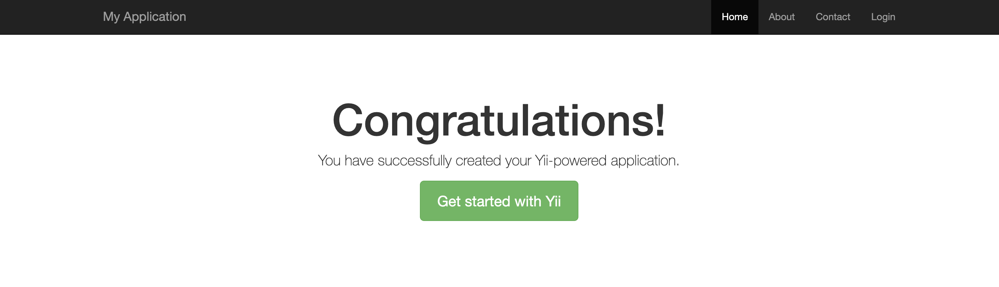

Yii2 执行流程分析
-------

### 安装Yii

首先通过 `composer create-project --prefer-dist yiisoft/yii2-app-basic yii-see` 创建一个yii程序应用程序模板。

### 验证安装结果

通过命令行启动 web server. 在项目根目录下执行 `php yii serve --port=8233` 

打开浏览器访问 [http://localhost:8233](http://localhost:8233)



### yii请求执行流程分析

首先打开项目的入口文件`web/index.php`.

```php
<?php

// 定义两个常量用来标识开发环境，在正式环境中应该注释掉下面两行代码
defined('YII_DEBUG') or define('YII_DEBUG', true);
defined('YII_ENV') or define('YII_ENV', 'dev');

// 引入 composer autoload 文件使得依赖可以自动加载
require __DIR__ . '/../vendor/autoload.php';
// 注册 yii 类文件的自动加载函数，并且实例化一个DI容器
require __DIR__ . '/../vendor/yiisoft/yii2/Yii.php';
// 获取配置中的配置项信息，返回的 $config 是一个多维关联数组
$config = require __DIR__ . '/../config/web.php';
// 实例化一个Application并且执行run方法
(new yii\web\Application($config))->run();

```

`yii\web\Application`类的`run`方法继承自`yii\base\Application`, 我们具体看一下`run`方法的定义。

```php
<?php

namespace yii\base;

use Yii;

abstract class Application extends Module
{
    /**
     * @var int 记录当前应用生命周期的状态值
     */
    public $state;

    /**
     * 构造器
     * @param array $config 键值对关联数组
     */
    public function __construct($config = [])
    {
        Yii::$app = $this;
        static::setInstance($this);

        // 生命周期开始
        $this->state = self::STATE_BEGIN;
        // 对传入的配置信息数组进行处理，详细的处理逻辑后续再进行讲解
        $this->preInit($config);

        $this->registerErrorHandler($config);

        Component::__construct($config);
    }

    /**
     * 程序的入口
     * @return int 程序推出状态 (0 表示正常退出, 非零表示程序异常退出)
     */
    public function run()
    {
        try {
            // 可以看出，yii 应用程序的生命周期
            // 开始 -> 处理请求之前 -> 处理请求中 -> 处理请求之后 -> 发送响应 -> 结束 进程退出 
            // 请求在每一个阶段都会执行相应的回调函数
            $this->state = self::STATE_BEFORE_REQUEST;
            $this->trigger(self::EVENT_BEFORE_REQUEST);

            $this->state = self::STATE_HANDLING_REQUEST;
            // 处理请求，它的实现在其子类上，我们跳回 yii\web\Application 查看请求的逻辑
            $response = $this->handleRequest($this->getRequest());

            $this->state = self::STATE_AFTER_REQUEST;
            $this->trigger(self::EVENT_AFTER_REQUEST);

            $this->state = self::STATE_SENDING_RESPONSE;
            $response->send();

            $this->state = self::STATE_END;

            return $response->exitStatus;
        } catch (ExitException $e) {
            $this->end($e->statusCode, isset($response) ? $response : null);
            return $e->statusCode;
        }
    }

    abstract public function handleRequest($request);

}
```

`yii\web\Application`

```php
class Application extends \yii\base\Application
{
    /**
     * 处理请求
     * @param Request $request the request to be handled
     * @return Response the resulting response
     * @throws NotFoundHttpException if the requested route is invalid
     */
    public function handleRequest($request)
    {
        if (empty($this->catchAll)) {
            try {
                // 通过路由规则解析出请求对应的路由和参数，异常的逻辑我们先不管，一切按照正常逻辑往下看
                list($route, $params) = $request->resolve();
            } catch (UrlNormalizerRedirectException $e) {
                // 异常处理
            }
        } else {
            $route = $this->catchAll[0];
            $params = $this->catchAll;
            unset($params[0]);
        }
        try {
            Yii::debug("Route requested: '$route'", __METHOD__);
            $this->requestedRoute = $route;
            // 重点看这里，通过路由和参数执行 action，我们直接步入 runAction 方法查看
            $result = $this->runAction($route, $params);
            // 请求的结果处理
            if ($result instanceof Response) {
                return $result;
            }

            $response = $this->getResponse();
            if ($result !== null) {
                $response->data = $result;
            }
            // 返回响应对象
            return $response;
        } catch (InvalidRouteException $e) {
            throw new NotFoundHttpException(Yii::t('yii', 'Page not found.'), $e->getCode(), $e);
        }
    }
}
```

`runAction` 的定义位于 `yii\base\Module`

```php

class Module extends ServiceLocator
{
    public function runAction($route, $params = [])
    {
        // 创建路由对应的 Controller 的实例
        $parts = $this->createController($route);
        if (is_array($parts)) {
            /* @var $controller Controller */
            list($controller, $actionID) = $parts;
            $oldController = Yii::$app->controller;
            Yii::$app->controller = $controller;
            // 通过控制器的 runAction 方法执行相应的 action
            // 并将 action 的返回值返回给 请求处理
            $result = $controller->runAction($actionID, $params);
            if ($oldController !== null) {
                Yii::$app->controller = $oldController;
            }

            return $result;
        }

        $id = $this->getUniqueId();
        throw new InvalidRouteException('Unable to resolve the request "' . ($id === '' ? $route : $id . '/' . $route) . '".');
    }

}
```

好了，至此我们完成了yii执行流程的分析；

1. 入口文件完成自动加载的注册，获取配置文件，实例化 Application 对象。
2. 调用 run 函数进入应用的生命周期处理。
3. 执行请求处理函数handRequest，解析出请求对应的Controller以及action。
4. 实例化对应的Controller，并调用其action将结果返回。